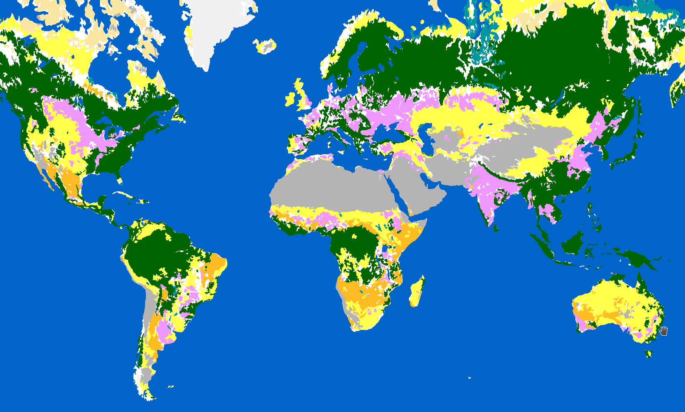

# ESA Worldcover Polygons

## Overview

This repo contains polygons with different spatial resolutions of the <a href="https://worldcover2021.esa.int/">ESA Worldcover dataset</a>, a landuse and landcover raster collection. The polygons can for example be used to generate a landcover vector tileset.

The ESA Worldcover raster images have a spatial resolution of 10 m per pixel. We downsample these images to a resolution of `0.1 / 2 ** k` degrees for `k=0..8` which corresponds at the equator to 11 km per pixel for `k=0` and 44 m per pixel for `k=8`.

The downsampled raster images are then filtered with a median blur and a sieve, then get polygonized, and subsequently the polygons are smoothed with the midpoint method.

To keep the size of images roughly equal, we subdivide the latitude range -85 to 85 degrees and the longitude range -180 to 180 degrees into `2**k` ranges. This means at `k=0` we have 1 image, at `k=1` we have 4 images, and so on. These images are indexed by `i` and `j`.

## License

The code in this repository is licensed as MIT.

The ESA Worldcover dataset is licensed as Creative Commons Attribution 4.0 International License, see Terms of use at https://worldcover2021.esa.int/download.

Using the ESA Worldcover polygons from this repo requires attribution to the original ESA Worldcover dataset.

## Demo

https://wipfli.github.io/esa-worldcover-polygons

<a href="https://wipfli.github.io/esa-worldcover-polygons">

</a>

## Downloads

GeoPackage polygons (55.35 GB):

https://pub-726b01260c98468a9387cc0dfcb7386b.r2.dev/esa-worldcover-polygons-gpkg.tar

Vector tiles (6.31 GB):

https://pub-726b01260c98468a9387cc0dfcb7386b.r2.dev/esa-worldcover-polygons.pmtiles

## Steps

Download the ESA Worldcover GeoTiffs with:

```bash
cd downloads/
./download.sh
./unzip-all.sh
```

Create a Virtual Raster (VRT) `mosaic.vrt` that combines all the ESA GeoTiffs into one file:

```bash
gdalbuildvrt mosaic.vrt downloads/ESA_*.tif 
```

Create tif samples:

```bash
python3 sample.py
```

Filter samples and polygonize them with:

```bash
python3 filter.py
```

To zip:

```bash
python3 to_zip.py
```

Run planetiler:

```
cd planetiler
./regenerate-swissmap.sh
```
